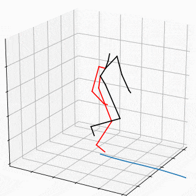

# QuaterNet: A Quaternion-based Recurrent Model for Human Motion

This is the implementation of the approach described in the paper:
> Dario Pavllo, David Grangier, and Michael Auli. [QuaterNet: A Quaternion-based Recurrent Model for Human Motion](https://arxiv.org/abs/1805.06485). In *British Machine Vision Conference (BMVC)*, 2018.

We provide the code for reproducing our results (*short-term prediction*) and generating/rendering locomotion animations (*long-term generation*), as well as pre-trained models.

### Abstract
Deep learning for predicting or generating 3D human pose sequences is an active research area. Previous work regresses either joint rotations or joint positions. The former strategy is prone to error accumulation along the kinematic chain, as well as discontinuities when using Euler angle or exponential map parameterizations. The latter requires re-projection onto skeleton constraints to avoid bone stretching and invalid configurations. This work addresses both limitations. Our recurrent network, *QuaterNet*, represents rotations with quaternions and our loss function performs forward kinematics on a skeleton to penalize absolute position errors instead of angle errors. On short-term predictions, *QuaterNet* improves the state-of-the-art quantitatively. For long-term generation, our approach is qualitatively judged as realistic as recent neural strategies from the graphics literature.

## Dependencies
- Python 3+ distribution
- PyTorch >= 0.4.0
- NumPy and SciPy

Optional:
- Matplotlib, if you want to render and display interactive animations. Additionally, you need *ffmpeg* to export MP4 videos, and *imagemagick* to export GIFs.
- A decent GPU, if you want to train the models in reasonable time. If you plan on testing the pretrained models, the CPU is fine.

The scripts detect automatically if a GPU is available. If you want to force CPU training/generation, you can set the `CUDA_VISIBLE_DEVICES` environment variable to an empty value. Within bash, you can limit its scope to a single command by calling `CUDA_VISIBLE_DEVICES= python <script> <args>`.

## Short-term prediction
If you want to train the model from scratch, you have to run the download script first:
```
python prepare_data_short_term.py
```
This will download the [Human3.6M](http://vision.imar.ro/human3.6m/description.php) dataset, convert it to our encoding, and save it in `datasets/dataset_h36m.npz`.
Then, train the model and test it:
```
python train_short_term.py
python test_short_term.py
```
If you use the pre-trained model you don't need to download the dataset and you can run the test script directly. Make sure that `weights_short_term.bin` is in the same directory as the script.

The script `baseline_short_term.py` reproduces the *zero-velocity baseline*, and should yield the same results as [Martinez et al. 2017](https://arxiv.org/abs/1705.02445).

## Long-term generation of locomotion
For locomotion we rely on [Holden's et al. dataset](http://theorangeduck.com/page/deep-learning-framework-character-motion-synthesis-and-editing) instead of Human3.6M, as the former contains a wider variety of motion. As before, if you want to train the models yourself instead of using the pretrained ones, download and convert the dataset by launching:
```
python prepare_data_long_term.py
```
The data will be saved in `datasets/dataset_locomotion.npz`. Then, you have to train the *pace network* and *pose network* separately:
```
python train_pace_network.py
python train_long_term.py
```
If your system has more than one GPU, you can save time by training all models in parallel:
```
CUDA_VISIBLE_DEVICES=0 python train_pace_network.py
CUDA_VISIBLE_DEVICES=1 python train_long_term.py
```
Once you have the weight files `weights_pace_network.bin` and `weights_long_term.bin` in place, take a look at the notebook `visualization.ipynb`, which shows how to render an animation. The script `test_long_term.py` performs predictions across the entire dataset and shows them on an interactive 3D plot. You can also generate animations in an offline fashion and export them as MP4 videos or GIFs.
- `python test_long_term.py`: visualize all animations interactively (GUI).
- `python test_long_term.py --list`: list the animations in the dataset.
- `python test_long_term.py run_1_d0`: visualize the animation `run_1_d0` interactively (GUI).
- `python test_long_term.py run_1_d0 output.mp4`: render `run_1_d0` and save it as `output.mp4`.
- `python test_long_term.py run_1_d0 output.gif`: render `run_1_d0` and save it as `output.gif`.



## Expected training/generation time
NVIDIA Pascal GP100 (Quadro GP100, Tesla P100):
 - Short-term pose network: 22 min for 3000 epochs (0.44 s/epoch), batch size = 60
 - Long-term pose network: 2h 10 min for 4000 epochs (1.95 s/epoch), batch size = 40
 - Pace network: 10 min for 2000 epochs (0.3 s/epoch), batch size = 40
 - **Generation**: 900 FPS, batch size = 1

NVIDIA Maxwell GM200 (Tesla M40, Titan X, GeForce 980 Ti, Quadro M6000):
 - Short-term pose network: 32 min for 3000 epochs (0.64 s/epoch), batch size = 60
 - Long-term pose network: 2h 45 min for 4000 epochs (2.5 s/epoch), batch size = 40
 - Pace network: 10 min for 2000 epochs (0.3 s/epoch), batch size = 40
 - **Generation**: 820 FPS, batch size = 1

## Pre-trained models
You can download them from the *Releases* section of this repository. You only need to put the weight files `weights_pace_network.bin`, `weights_long_term.bin`, and `weights_short_term.bin` in the root directory. 

## License
This work is licensed under CC BY-NC. See `LICENSE` for details. Third-party datasets are subject to their respective licenses.
If you use our code/models in your research, please cite our paper:
```
@inproceedings{pavllo:quaternet:2018,
  title={QuaterNet: A Quaternion-based Recurrent Model for Human Motion},
  author={Pavllo, Dario and Grangier, David and Auli, Michael},
  booktitle={British Machine Vision Conference (BMVC)},
  year={2018}
}
```
